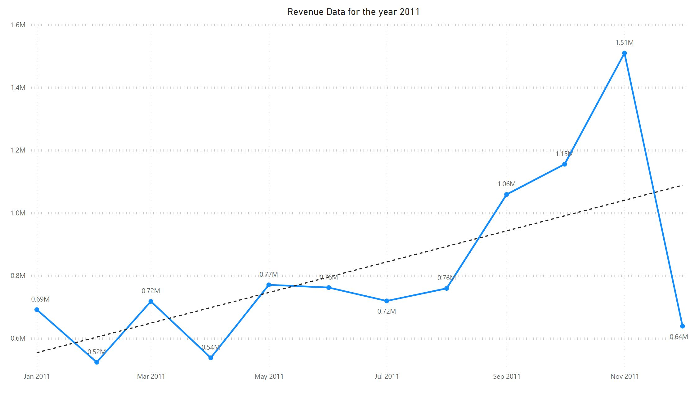
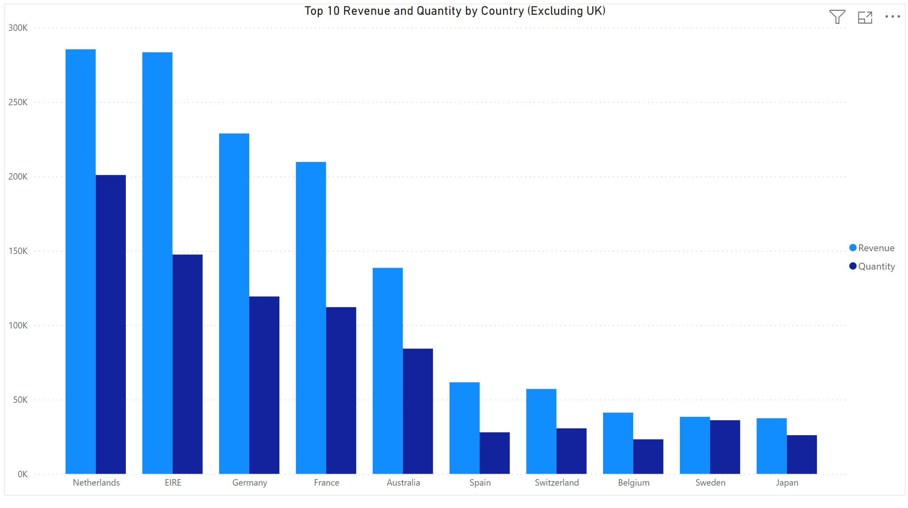
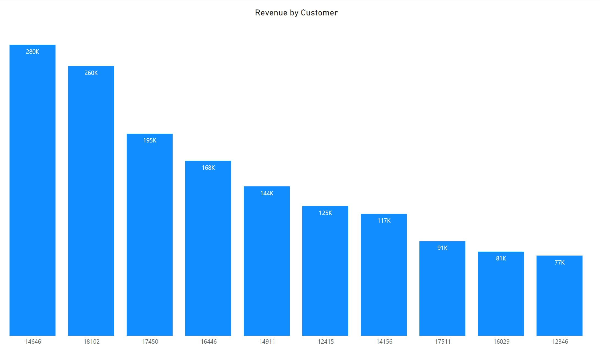
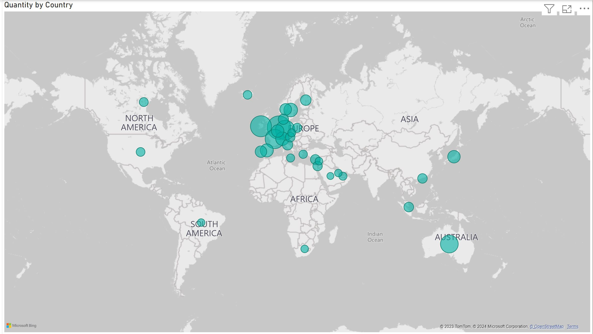

# TATA_Internship_Program

## Background

As a consultant hired by an online retail store, I was tasked with analyzing their data to provide valuable insights for the CEO and CMO. The objective was to understand the key factors contributing to revenue and facilitate strategic planning for the upcoming year.

The management seeks insights from both operational and marketing perspectives to comprehend the drivers behind the business's success. Additionally, with expansion plans in mind, they aim to focus on areas demonstrating strong performance. Demographic information within the data is also of interest to assess various metrics.

In preparation for an upcoming meeting with the CEO and CMO, my goal was to compile analytics that evaluate the current business performance and propose relevant metrics crucial for their decision-making regarding expansion.

Considering the viewpoint of business leaders, I analyzed the data and uncovered meaningful insights that aligned with their strategic objectives. Leveraging resources to understand how business leaders approach performance evaluation guided my analysis and presentation of insights effectively.

## Task 1

In preparation for the meeting, I drafted a set of questions that I anticipated the CEO and CMO might ask and want to know the answers to. These questions served as my blueprint while developing the presentation.

Upon reviewing the provided dataset, I examined the information available to extract valuable insights relevant to the CEO and CMO's concerns. I made a note of the data points and patterns that could offer quantitative and qualitative perspectives.

**Questions of interest to the CEO**

1. Which region is generating the highest revenue, and which region is generating the lowest?

2. What is the monthly trend of revenue, which months have faced the biggest increase/decrease?

3. Which months generated the most revenue? Is there a seasonality in sales?

4. Who are the top customers and how much do they contribute to the total revenue? Is the business dependent on these customers or is the customer base diversified?

**Questions of interest to the CMO**

1. What is the percentage of customers who are repeating their orders? Are they ordering the same products or different?

2. For repeat customers, how long does it take to place the next order after being delivered the previous one?

3. What revenue is being generated from the customers who have ordered more than once?

4. Who are the customers that have repeated the most? How much are they contributing to revenue?

## Task 2

In response to the meeting with the CEO and CMO, I was tasked with creating visuals that highlight crucial metrics for analysis within the online retail store. My role involved understanding their requirements and determining the most suitable visualizations for presenting the necessary insights.

The senior management sought a comprehensive overview of the company's performance, emphasizing identifying strengths and potential growth opportunities to increase revenue.

Given multiple visualization requests from the CEO, my responsibility was to select visuals that effectively conveyed complex data straightforwardly. It was paramount to ensure that each visualization accurately represented the information to avoid misinterpretation or flawed decision-making by the management.

This exercise held significant importance for the senior management, as the visuals served as a pivotal tool in shaping their understanding of the business. Precise and accurate representation of data through visuals was critical to facilitate informed decision-making and strategic planning. Hence, careful consideration was given to selecting the most appropriate visuals for each dataset.

Both executives expressed a keen interest in leveraging data for more informed decision-making, particularly in shaping the expansion strategy for the online store.

They focused on comprehending revenue generation trends and breakdowns by various categories within the data. The objective was to gain clarity on how revenue is being generated and to identify the primary factors influencing the online store's performance.

Upon receiving the executives' requirements for data presentation, I conducted a thorough data quality check to ensure its integrity and cleanliness. Eliminating any erroneous or problematic data was crucial to prevent any adverse impacts on the ensuing analysis.

Subsequently, using Power BI, I crafted visuals aligning with the executives' specifications. The goal was to provide insights through visualizations that remained consistent regardless of the tool used. These results aimed to facilitate effective decision-making for the executives' expansion strategy, empowering them with actionable insights derived from the data analysis.

### Data Cleaning

Before commencing the analysis, my first task was to ensure the data was properly cleaned. I observed instances of returns to the store represented by negative quantities and identified input errors in some unit prices. To rectify these issues, I followed specific steps for data cleanup:

- Created a validation check to ensure that the quantity recorded is not below 1 unit.
- Implemented a validation check to ensure that the unit price is not below $0.
- implemented a validation check to ensure that the description had no blank field.

Applying these checks involved utilizing conditional formulas to exclude erroneous data from the analysis. The objective was to eliminate flawed data points that did not meet the established criteria.

It was crucial to execute these data cleanup steps meticulously before proceeding with any further analysis. By performing these checks and transformations, the data was prepared appropriately for subsequent analysis, ensuring its quality and integrity for accurate insights.

### Visualization

I was tasked to create compelling visuals that answered the stakeholder's questions.

**Question 1**

The CEO of the retail store is interested in viewing the time series of the revenue data for the year 2011 only. He would like to view granular data by looking into revenue for each month. The CEO is interested in viewing the seasonal trends and wants to dig deeper into why these trends occur. This analysis will be helpful for the CEO to forecast for the next year.

**Question 2**

The CMO is interested in viewing the top 10 countries which are generating the highest revenue. Additionally, the CMO is also interested in viewing the quantity sold along with the revenue generated. The CMO does not want to have the United Kingdom in this visual.

**Question 3**

The CMO of the online retail store wants to view the information on the top 10 customers by revenue. He is interested in a visual that shows the greatest revenue-generating customer at the start and gradually declines to the lower revenue-generating customers. The CMO wants to target the higher revenue-generating customers and ensure that they remain satisfied with their products.

**Question 4**

The CEO is looking to gain insights into the demand for their products. He wants to look at all countries and see which regions have the greatest demand for their products. Once the CEO gets an idea of the regions that have high demand, he will initiate an expansion strategy which will allow the company to target these areas and generate more business from these regions. He wants to view the entire data on a single view without the need to scroll or hover over the data points to identify the demand. There is no need to show data for the United Kingdom as the CEO is more interested in viewing the countries that have expansion opportunities.

